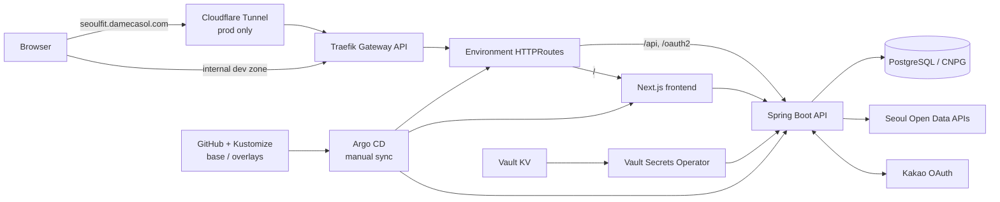

# Seoul Fit Backend

서울시 공공데이터를 수집·조회하고 카카오 로그인, 사용자 관심사, 알림 이력을 제공하는 Seoul Fit API입니다.

## 현재 구성

- Java 21, Spring Boot 3.5, Gradle
- Spring Security, 카카오 단일 OAuth 2.0, JWT
- PostgreSQL(CNPG), Flyway, Spring Data JPA
- local 프로파일의 H2·Swagger UI
- Spring Boot Actuator와 Prometheus 형식 메트릭
- Kubernetes, Kustomize, Argo CD, Vault Secrets Operator, Traefik Gateway API



prod는 `https://seoulfit.damecasol.com`에서 Cloudflare Tunnel을 거쳐 공개됩니다. dev는 내부 DNS 존에서만 접근합니다. TLS와 라우팅은 Traefik `Gateway`/`HTTPRoute`가 담당합니다.

## 로컬 실행

필수 도구는 Java 21입니다. 저장소의 Gradle Wrapper를 사용하므로 별도 Gradle 설치는 필요하지 않습니다.

```bash
git clone https://github.com/seoul-fit/backend.git
cd backend
SPRING_PROFILES_ACTIVE=local ./gradlew bootRun
```

local 프로파일은 인메모리 H2를 사용하고 Flyway를 끄며 개발 전용 기본값으로 기동합니다.

- API: `http://localhost:8080`
- Swagger UI: `http://localhost:8080/swagger-ui/index.html`
- H2 Console: `http://localhost:8080/h2-console`
- Health: `http://localhost:8080/actuator/health`
- Prometheus metrics: `http://localhost:8080/actuator/prometheus`

실제 서울시 데이터와 카카오 로그인을 확인하려면 본인 발급 자격증명을 환경 변수로 주입해야 합니다. 값을 소스나 문서에 기록하지 마세요.

```bash
./gradlew test
./gradlew build
```

## 프로파일과 데이터베이스

| 프로파일 | 데이터베이스 | 스키마 관리 | API 문서 |
|---|---|---|---|
| `local` | H2 in-memory | Hibernate `create` | Swagger 활성 |
| `dev` | CNPG PostgreSQL | Flyway + Hibernate `validate` | Swagger 활성 |
| `prod` | CNPG PostgreSQL | Flyway + Hibernate `validate` | Swagger 비활성 |

dev/prod의 datasource, JWT, 카카오 OAuth, 서울시 API, CORS 설정은 환경 변수로만 받습니다. Flyway migration은 [`src/main/resources/db/migration`](src/main/resources/db/migration)에 있습니다.

## 배포

애플리케이션 매니페스트는 [`infra/k8s/seoul-fit-backend`](infra/k8s/seoul-fit-backend)가 소유합니다.

- `base`: Deployment, Service, ServiceAccount, Vault VSO 리소스
- `overlays/dev`, `overlays/prod`: namespace, 프로파일, DB 접근 라벨, HTTPRoute, 환경별 이미지 digest
- 컨테이너 이미지는 tag가 아니라 `sha256` digest로 고정합니다.
- Argo CD Application `seoul-fit-backend-dev`와 `seoul-fit-backend-prod`는 각각 `main`의 overlay를 추적하며 manual sync입니다.
- Vault Secrets Operator가 KV를 Kubernetes Secret으로 변환하고 대상 Deployment를 재시작합니다.

Vault KV v2 경로는 다음과 같습니다. 경로만 공개하며 값은 저장소에 두지 않습니다.

- `kv/data/projects/seoul-fit/backend-dev`
- `kv/data/projects/seoul-fit/backend-prod`
- `kv/data/projects/seoul-fit/harbor-pull`

## 저장소 구조

```text
src/main/java/                       application source
src/main/resources/application-*.yml  local/dev/prod configuration
src/main/resources/db/migration/     Flyway migrations
src/test/                            automated tests
infra/k8s/seoul-fit-backend/         kustomize base and overlays
docs/BACKLOG.md                      deferred work and rationale
```

계획적으로 미룬 작업과 현재 제한은 [`docs/BACKLOG.md`](docs/BACKLOG.md)에 기록합니다.

## License

[MIT](LICENSE)
