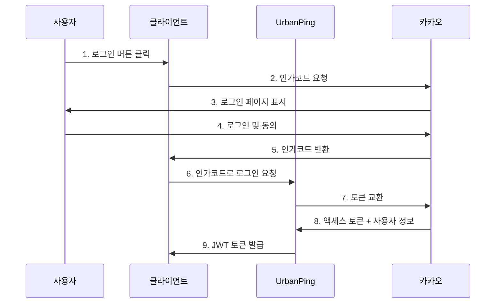

# OAuth 인증 시스템 가이드

> UrbanPing의 OAuth 2.0 기반 소셜 로그인 시스템 구현 및 설정 가이드

## 📋 OAuth 시스템 개요

UrbanPing은 **OAuth 2.0 Authorization Code Flow**를 사용하여 안전하고 표준적인 소셜 로그인을 제공합니다.

### 🎯 지원하는 OAuth 제공자
- **카카오 (Kakao)**: 주요 OAuth 제공자
- **향후 확장**: 네이버, 구글 등 추가 예정

### 🔐 보안 특징
- **Authorization Code Flow**: 가장 안전한 OAuth 플로우
- **JWT 토큰**: 상태 비저장 인증
- **토큰 갱신**: 자동 토큰 리프레시
- **PKCE 지원**: 추가 보안 강화

## 📚 가이드 문서

### 🚀 빠른 시작
1. **[카카오 OAuth 설정](kakao-setup.md)** - 카카오 개발자 콘솔 설정 (필수)
2. **[일반 OAuth 가이드](general-guide.md)** - OAuth 2.0 구현 방법
3. **[인증 체크 API](authorize-check-api.md)** - 인증 상태 확인 방법

### 📖 상세 가이드

#### 1. [카카오 OAuth 설정 가이드](kakao-setup.md)
- 카카오 개발자 콘솔 앱 생성
- OAuth 리다이렉트 URI 설정
- 앱 키 발급 및 관리
- 카카오 로그인 활성화

#### 2. [OAuth 일반 가이드](general-guide.md)
- OAuth 2.0 플로우 이해
- Authorization Code 방식 구현
- JWT 토큰 관리
- 에러 처리 및 예외 상황

#### 3. [인증 체크 API 가이드](authorize-check-api.md)
- 인증 상태 확인 방법
- 토큰 유효성 검증
- 사용자 정보 조회
- 로그아웃 처리

## 🔄 OAuth 플로우

### 표준 로그인 플로우


### 주요 단계 설명

1. **인가코드 획득**: 카카오에서 사용자 동의 후 인가코드 발급
2. **토큰 교환**: 인가코드를 액세스 토큰으로 교환
3. **사용자 정보 조회**: 액세스 토큰으로 사용자 정보 획득
4. **JWT 발급**: UrbanPing 자체 JWT 토큰 생성 및 반환

## 🛠️ 구현 예제

### 프론트엔드 (JavaScript)
```javascript
// 1. 카카오 로그인 버튼 클릭
const handleKakaoLogin = () => {
  const kakaoAuthUrl = `https://kauth.kakao.com/oauth/authorize?` +
    `client_id=${KAKAO_CLIENT_ID}&` +
    `redirect_uri=${REDIRECT_URI}&` +
    `response_type=code`;
  
  window.location.href = kakaoAuthUrl;
};

// 2. 리다이렉트 후 인가코드 처리
const handleAuthCallback = async (authCode) => {
  const response = await fetch('/api/auth/oauth/login', {
    method: 'POST',
    headers: { 'Content-Type': 'application/json' },
    body: JSON.stringify({
      provider: 'KAKAO',
      authorizationCode: authCode,
      redirectUri: REDIRECT_URI
    })
  });
  
  const { accessToken } = await response.json();
  localStorage.setItem('token', accessToken);
};
```

### 백엔드 (Spring Boot)
```java
@PostMapping("/oauth/login")
public ResponseEntity<TokenResponse> oauthLogin(
    @RequestBody OAuthLoginRequest request) {
    
    // 인가코드로 카카오 토큰 교환
    OAuthAuthorizationCommand command = OAuthAuthorizationCommand.of(
        request.getProvider(),
        request.getAuthorizationCode(),
        request.getRedirectUri()
    );
    
    // JWT 토큰 발급
    TokenResult result = authenticateUserUseCase
        .oauthLoginWithAuthorizationCode(command);
    
    return ResponseEntity.ok(TokenResponse.from(result));
}
```

## 🔧 설정 및 환경변수

### 필수 환경변수
```bash
# 카카오 OAuth 설정
KAKAO_CLIENT_ID=your-kakao-app-key
KAKAO_CLIENT_SECRET=your-kakao-client-secret
KAKAO_REDIRECT_URI=http://localhost:3000/auth/callback

# JWT 설정
JWT_SECRET=your-jwt-secret-key-minimum-32-characters
JWT_EXPIRATION=86400000  # 24시간
```

### application.yml 설정
```yaml
oauth:
  kakao:
    client-id: ${KAKAO_CLIENT_ID}
    client-secret: ${KAKAO_CLIENT_SECRET}
    redirect-uri: ${KAKAO_REDIRECT_URI}
    authorization-uri: https://kauth.kakao.com/oauth/authorize
    token-uri: https://kauth.kakao.com/oauth/token
    user-info-uri: https://kapi.kakao.com/v2/user/me

jwt:
  secret: ${JWT_SECRET}
  expiration: ${JWT_EXPIRATION:86400000}
```

## ❌ 문제 해결

### 자주 발생하는 오류

#### 1. 인가코드 만료
```json
{
  "error": "invalid_grant",
  "error_description": "authorization code expired"
}
```
**해결방법**: 인가코드는 10분 내에 사용해야 함

#### 2. 리다이렉트 URI 불일치
```json
{
  "error": "invalid_request",
  "error_description": "redirect_uri mismatch"
}
```
**해결방법**: 카카오 개발자 콘솔의 리다이렉트 URI와 정확히 일치해야 함

#### 3. 앱 키 오류
```json
{
  "error": "invalid_client",
  "error_description": "client authentication failed"
}
```
**해결방법**: 카카오 앱 키 및 시크릿 키 확인

### 디버깅 팁
- **로그 확인**: OAuth 관련 로그 레벨을 DEBUG로 설정
- **네트워크 탭**: 브라우저 개발자 도구에서 API 호출 확인
- **토큰 검증**: JWT 토큰을 jwt.io에서 디코딩하여 확인

## 📞 지원 및 문의

- **카카오 개발자 문서**: https://developers.kakao.com/
- **GitHub Issues**: OAuth 관련 이슈 등록
- **API 문서**: [인증 API](../../api/authentication.md)

---

**업데이트**: 2025-01-XX  
**버전**: v1.0.0
